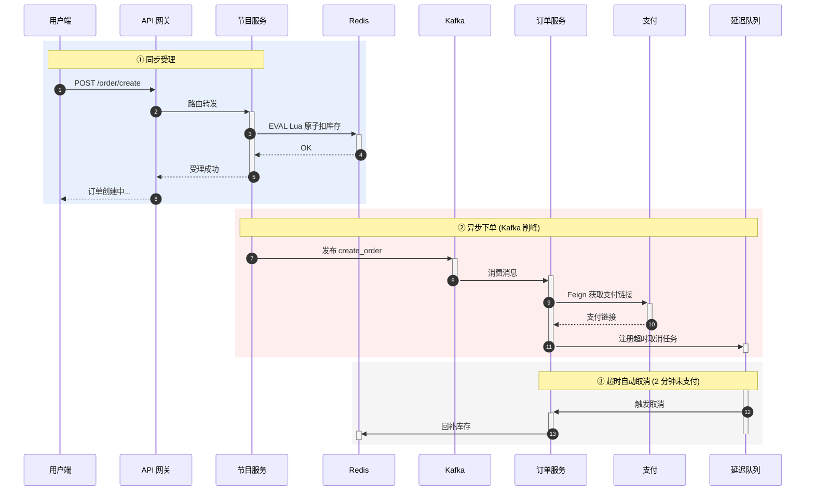
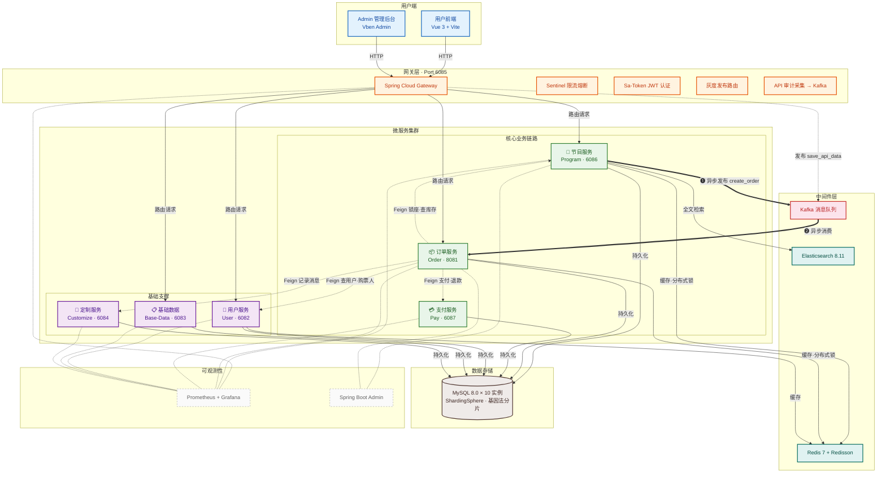
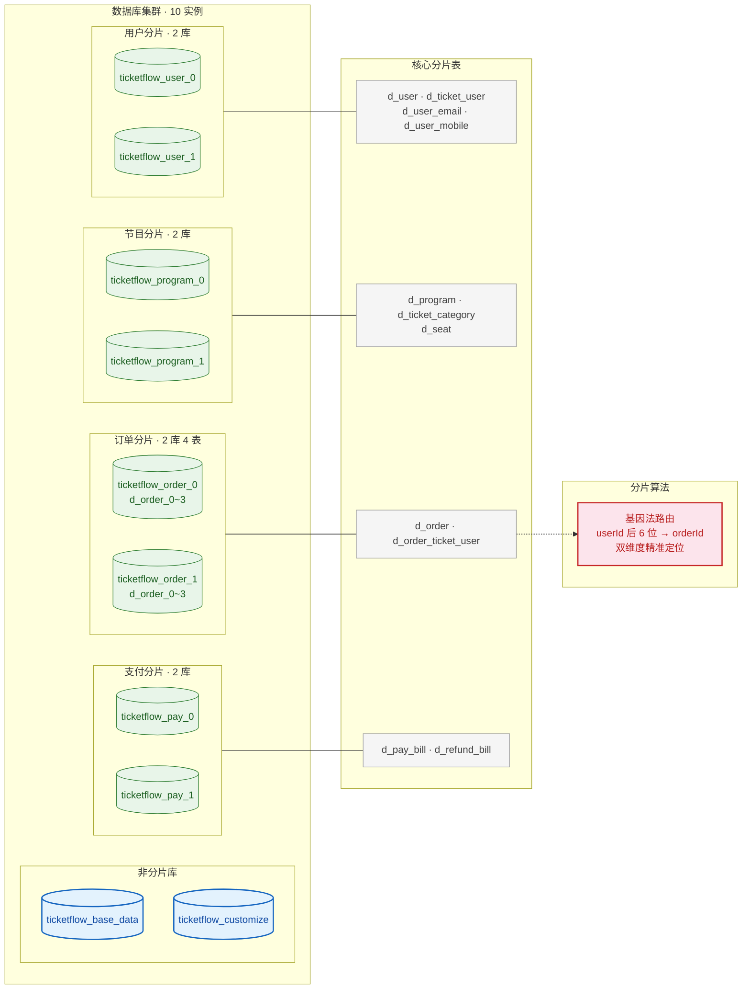

<div align="center">
  
  <h1>TicketFlow</h1>
  <p><b>高并发在线票务交易平台</b></p>

  <p>
    <a href="#项目简介">项目简介</a> •
    <a href="#核心技术">核心技术</a> •
    <a href="#系统架构">系统架构</a> •
    <a href="#技术栈">技术栈</a> •
    <a href="#数据库架构">数据库架构</a> •
    <a href="#快速开始">快速开始</a> •
    <a href="#api-文档">API 文档</a> •
    <a href="#项目结构">项目结构</a>
  </p>

  <p>
    
    
    
    
    
    
    
    
    
  </p>
</div>

---

## 项目简介

**TicketFlow** 是一款面向演唱会、体育赛事等高并发抢票场景的在线票务交易平台。系统基于 **Spring Cloud Alibaba** 微服务架构构建，围绕**库存一致性、流量削峰、系统可用性**三大核心挑战，深度整合 Redis、Kafka、ShardingSphere 等组件，形成了一套完整的高并发解决方案。


---

## 核心技术

### 基因法分片路由

基于 ShardingSphere 自定义分片算法，将 `userId` 的 Hash 值嵌入 `orderId` 基因位，实现 **user_id** 与 **order_number** 双维度精准路由。

- 订单号预留 6 位基因位，支撑 8 库 8 表共 64 种分片组合
- 同一用户的所有订单落在同一分片，避免跨库查询与读扩散
- 支持 1024 个虚拟槽位，物理表可在不停机状态下从 8 张扩至 4096 张

### 统一分布式锁框架

封装 Redisson 实现统一分布式锁框架，提供多锁模型支持：

| 锁模型 | 适用场景 |
|--------|----------|
| 可重入锁 | 常规并发控制 |
| 公平锁 | 先到先得场景 |
| 读写锁 | 读多写少场景 |
| 信号量 | 限流控制 |
| 联锁 | 多资源锁定 |

通过注解声明式使用，并精确调整 AOP 与事务拦截器执行顺序 — **加锁先于事务开启，释放晚于事务提交**，从框架层杜绝锁与事务的时序竞态问题。

### 多级缓存架构

构建 **Caffeine → Redis → MySQL** 三级缓存架构：

```
请求 → Caffeine (本地缓存) → Redis (分布式缓存) → MySQL (数据库)
        命中即返回            缓存失效回源        兜底持久化
```

- 通过 **Redis Stream** 广播缓存失效事件，驱动集群节点本地缓存同步失效
- 利用 Caffeine 同 Key 请求合并机制，避免缓存击穿导致数据库压力放大
- 布隆过滤器拦截无效节目 ID 查询，进一步保护数据库

### 异步下单链路

基于 Lua + Redis + Kafka 构建高性能异步下单链路：



- **Lua 脚本**保证库存扣减原子性
- **Kafka** 实现流量削峰与订单异步解耦
- **延迟任务**机制实现超时订单自动取消与库存回补

---

## 系统架构



### 服务间通信矩阵

| 方式 | 协议/工具 | 场景 |
|------|-----------|------|
| 同步调用 | OpenFeign + OkHttp | 服务间实时查询与操作 |
| 异步消息 | Kafka | 订单创建解耦、API 审计日志 |
| 缓存失效 | Redis Stream | 节目变更广播、本地缓存同步 |
| 分布式锁 | Redisson | 并发下单、库存扣减原子性 |
| 延迟调度 | Redisson Delayed Queue | 订单超时自动取消 |
| 防缓存穿透 | 布隆过滤器 | 注册判重、节目详情保护 |

---

## 技术栈

### 后端

| 分类 | 技术 | 版本 |
|------|------|------|
| **语言** | Java | 17 |
| **主框架** | Spring Boot | 3.3.0 |
| **微服务** | Spring Cloud Alibaba | 2023.0.1.0 |
| **注册/配置中心** | Nacos | 2.4.0 |
| **API 网关** | Spring Cloud Gateway | 2023.0.2 |
| **限流熔断** | Sentinel | 1.8.8 |
| **ORM** | MyBatis-Plus | 3.5.7 |
| **分库分表** | Apache ShardingSphere JDBC | 5.3.2 |
| **缓存** | Redis 7 + Redisson | 3.32.0 |
| **消息队列** | Kafka (KRaft 模式) | 3.6 |
| **搜索引擎** | Elasticsearch | 8.11.0 |
| **认证授权** | Sa-Token + JWT | 1.43.0 |
| **支付** | 支付宝 SDK | 4.38.197.ALL |
| **监控** | Spring Boot Admin / Prometheus / Grafana | — |
| **API 文档** | Knife4j + SpringDoc OpenAPI 3 | 4.3.0 |

### 前端

| 应用 | 技术栈 |
|------|--------|
| **用户端** | Vue 3 + TypeScript + Vite 6 + Element Plus + Pinia + Axios |
| **管理端 (Admin)** | Vue 3 + TypeScript + Vite 6 + Element Plus + Pinia + Tailwind CSS |

---

## 数据库架构

基于 **Apache ShardingSphere JDBC** 分库分表，共 10 个数据库实例：



| 数据库 | 分片数 | 核心表 |
|--------|--------|--------|
| `ticketflow_base_data` | 1 | `d_area`, `d_channel_data`, `d_program_category` |
| `ticketflow_customize` | 1 | `d_api_data`, `d_rule`, `d_message_record` |
| `ticketflow_user_0 / _1` | 2 | `d_user`, `d_ticket_user`, `d_user_email`, `d_user_mobile` |
| `ticketflow_program_0 / _1` | 2 | `d_program`, `d_ticket_category`, `d_seat` |
| `ticketflow_order_0 / _1` | 8 (4×2) | `d_order` (8 物理表), `d_order_ticket_user` |
| `ticketflow_pay_0 / _1` | 2 | `d_pay_bill`, `d_refund_bill` |

> **基因法分片**：订单号嵌入 userId 后 6 位作为基因，同时支持 `user_id` 和 `order_number` 维度精准路由到同一分片，避免跨库查询。

> **虚拟分片**：设计 1024 个虚拟槽位，物理表可从 8 张在线扩展到 4096 张，支持不停机扩缩容。

---

## 自研基础组件

| 组件 | 定位 | 核心能力 |
|------|------|----------|
| **分布式 ID 生成器** | 框架 | 融合百度 UID + 雪花算法，支持基因法订单号、RingBuffer 预缓存、Redis 自动分配 WorkerId |
| **验证码框架** | 框架 | 滑块拼图、文字点选两种验证，Spring Bean 委托分发，Local/Redis 双缓存 |
| **线程池框架** | 框架 | 自动透传 MDC traceId 与请求上下文，解决异步链路追踪断裂 |
| **灰度发布框架** | 框架 | 网关层 + WebMvc 拦截器双层灰度路由 |
| **Redis 工具框架** | 框架 | Redis Stream 广播消费、缓存工具 |
| **Redisson 框架** | 框架 | 分布式锁注解（可重入/公平/读写）、布隆过滤器、延迟队列 |
| **ES 框架** | 框架 | Elasticsearch 文档 CRUD 封装与查询 DTO 映射 |

---

## 微服务清单

| 服务 | 端口 | 核心职责 |
|------|------|----------|
| **Gateway 网关** | 6085 | 统一入口、Sentinel 限流、Sa-Token 认证、灰度路由、API 审计 |
| **User 用户服务** | 6082 | 注册登录、购票人管理、布隆过滤器防重 |
| **Base-Data 基础数据** | 6083 | 渠道密钥配置、地区管理、分类字典 |
| **Program 节目服务** | 6086 | 节目 CRUD、库存管理、选座锁定、ES 搜索、Kafka 触发下单 |
| **Order 订单服务** | 8081 | 订单全生命周期、分布式锁并发、延迟队列超时取消 |
| **Pay 支付服务** | 6087 | 支付宝统一下单、异步回调、退款 |
| **Customize 定制服务** | 6084 | 操作审计存储、消息可靠性保障 |
| **Migrate 迁移服务** | 6088 | 数据迁移、CSV 导入、路由映射刷新 |
| **Admin 监控** | 10082 | Spring Boot Admin 健康检查、JVM 监控 |

---

## 前端功能矩阵

### 用户端 — 消费者购票 SPA

```
首页 → 节目推荐 · 分类导航
节目详情 → 简介 · 票档选择 · 可视化选座
购物车 → 确认订单
支付 → 扫码支付 · 支付成功
订单管理 → 待支付 · 已支付 · 已取消
个人中心 → 个人信息 · 购票人管理 · 账户设置
```

### 管理端 (Admin) — 运营管理后台

```
仪表盘 → 运营数据概览
节目管理 → 节目/场次/票档增删改查
订单管理 → 订单查询 · 退款处理 · 废单管理
座位管理 → 座位图编辑 · 区域配置
基础数据 → 渠道配置 · 地区管理 · 分类字典
消息记录 → API 审计 · 消息可靠性查询
```

---

## 快速开始

### 环境要求

| 工具 | 版本要求 |
|------|----------|
| Java | 17+（推荐 Corretto） |
| Maven | 3.8+ |
| Node.js | 20+ |
| npm / pnpm | npm 9+ / pnpm 9+ |
| Docker & Docker Compose | 最新稳定版 |

### 启动基础设施

```bash
docker compose -f docker/docker-compose.yml up -d
```

启动后包含以下 9 个容器：

| 服务 | 镜像 | 端口 | 账号/密码 |
|------|------|------|----------|
| **MySQL** | mysql:8.0 | 3306 | `root` / `root` |
| **Redis 7** | redis:7 | 6379 | 无密码 |
| **Kafka** (KRaft) | bitnami/kafka:3.6 | 9092 | 无认证 |
| **Nacos** | nacos/nacos-server:v2.4.0 | 8848 (9848) | 无认证（单机模式） |
| **Elasticsearch** | docker.elastic.co/elasticsearch/elasticsearch:8.11.0 | 9200 (9300) | 无认证 |
| **Sentinel** | bladex/sentinel-dashboard:1.8.8 | 8082 | `sentinel` / `sentinel` |
| **Prometheus** | prom/prometheus:v2.53.0 | 9090 | 无认证 |
| **Grafana** | grafana/grafana:11.0.0 | 3000 | `admin` / `admin` |
| **Seata** | seataio/seata-server:1.8.0 | 8091 | 无认证 |

> Docker 数据卷持久化：`docker_mysql-data`, `docker_redis-data`, `docker_kafka-data`, `docker_nacos-data`, `docker_es-data`, `docker_prometheus-data`, `docker_grafana-data`, `docker_seata-data`

### 构建后端

```bash
# 全量构建（-T 4 启用 4 线程并行编译）
mvn clean install -DskipTests -T 4

# 按需构建单个服务
mvn clean install -pl ticketflow-server/ticketflow-gateway-service -am -DskipTests
```

### 启动后端服务

> 启动前需确保 `docker/mysql/client.cnf` 和 `docker/prometheus/prometheus.yml` 是**文件**而非目录（若已执行 `docker compose up` 则已就绪）。

```bash
# 在一键启动脚本中设置必要的环境变量
export JASYPT_ENCRYPTOR_PASSWORD=ticketflow
export KNIFE4J_PRODUCTION=false
```

按以下顺序启动（每启动一个等待几秒使其注册到 Nacos）：

```bash
SERVICES=("gateway" "base-data" "user" "program" "order" "pay" "customize" "migrate" "admin")

for s in "${SERVICES[@]}"; do
  JAR="ticketflow-server/ticketflow-$s-service/target/ticketflow-$s-service-0.0.1-SNAPSHOT.jar"
  java -Xms256m -Xmx512m -jar "$JAR" &
  sleep 4
done
```

各服务注册到 Nacos 后，可在 `http://localhost:8848/nacos` 查看状态。所有服务实例就绪后，Gateway 健康检查应返回 200：

```bash
curl -s http://localhost:6085/actuator/health
# → {"status":"UP"}
```

### 启动前端

```bash
# 用户端 (Vue 3)
cd vue3
npm install --legacy-peer-deps
npm run dev
# → http://localhost:5173

# 管理端 (Vben Admin)
cd ticketflow-front-manage
pnpm install
pnpm dev:ele
# → http://localhost:5555
```

### 访问入口一览

| 入口 | 地址 | 说明 |
|------|------|------|
| 用户端 | `http://localhost:5173` | Vue 3 购票前端 |
| 管理端 | `http://localhost:5555` | Vben Admin 运营后台 |
| API 网关 | `http://localhost:6085` | 所有后端 API 统一入口 |
| Knife4j API 文档 | `http://localhost:6085/doc.html` | 在线调试 |
| Nacos 控制台 | `http://localhost:8848/nacos` | 服务注册与发现 |
| Sentinel | `http://localhost:8082` | 限流熔断控制台 |
| Prometheus | `http://localhost:9090` | 指标采集 |
| Grafana | `http://localhost:3000` | 监控看板 |
| Spring Boot Admin | `http://localhost:10082` | 服务健康监控（admin/admin） |

---

## API 文档

系统采用 **Knife4j** 聚合各微服务的 OpenAPI 3.0 文档。

### 在线调试

浏览器打开 **http://localhost:6085/doc.html** 即可查看和调试所有服务的 API。

### 导入 Apifox

Apifox 支持通过 URL 直接导入 OpenAPI 格式的接口文档。各服务的导入地址如下：

| 服务 | 导入 URL |
|------|---------|
| 节目服务 | `http://127.0.0.1:6085/ticketflow/program/v3/api-docs/default` |
| 用户服务 | `http://127.0.0.1:6085/ticketflow/user/v3/api-docs/default` |
| 订单服务 | `http://127.0.0.1:6085/ticketflow/order/v3/api-docs/default` |
| 基础数据 | `http://127.0.0.1:6085/ticketflow/basedata/v3/api-docs/default` |
| 支付服务 | `http://127.0.0.1:6085/ticketflow/pay/v3/api-docs/default` |
| 定制服务 | `http://127.0.0.1:6085/ticketflow/customize/v3/api-docs/default` |
| 管理端 | `http://127.0.0.1:6085/ticketflow/admin/v3/api-docs/default` |
| 迁移服务 | `http://127.0.0.1:6085/ticketflow/migrate/v3/api-docs/default` |

操作步骤：

1. 在 Apifox 中创建/打开项目
2. 点击 **导入** → **OpenAPI/Swagger 格式**
3. 选择 **URL 导入**，粘贴上述任一地址
4. 按需调整导入选项（目标分支、接口冲突策略等），确认导入

> 每个服务的 OpenAPI 地址返回标准 JSON 格式，可直接用于 Apifox、Postman、Insomnia 等工具。

---

## 项目结构

```
ticketflow/
├── ticketflow-common/                         # 共享基础库
├── ticketflow-server/                         # 后端微服务
│   ├── ticketflow-gateway-service/            # API 网关
│   ├── ticketflow-user-service/               # 用户服务
│   ├── ticketflow-base-data-service/          # 基础数据
│   ├── ticketflow-program-service/            # 节目服务
│   ├── ticketflow-order-service/              # 订单服务
│   ├── ticketflow-pay-service/                # 支付服务
│   ├── ticketflow-customize-service/          # 定制服务
│   ├── ticketflow-admin-service/              # 监控服务
│   ├── ticketflow-migrate-service/            # 迁移服务
│   └── ticketflow-mybatis-plus-service/       # MyBatis-Plus 代码生成工具
├── ticketflow-server-client/                  # Feign API 接口
├── ticketflow-spring-cloud-framework/         # Spring Cloud 公共框架
├── ticketflow-redis-tool-framework/           # Redis 工具
├── ticketflow-redisson-framework/             # Redisson 封装
├── ticketflow-id-generator-framework/         # 分布式 ID 生成器
├── ticketflow-elasticsearch-framework/        # ES 集成
├── ticketflow-thread-pool-framework/          # 线程池透传
├── ticketflow-captcha-manage-framework/       # 验证码框架
├── sql/                                       # 数据库 DDL
├── docker/                                    # Docker Compose
├── vue3/                                      # 用户端前端
├── ticketflow-front-manage/                   # 管理端前端
└── benchmark/                                 # 压测
```

---

## 架构决策

| 决策项 | 方案 | 考虑 |
|--------|------|------|
| 分库分表 | ShardingSphere JDBC | 与应用深度集成，无额外部署，支持基因法自定义分片算法 |
| 异步下单 | Kafka | 削峰填谷，解耦节目服务与订单服务 |
| 分布式锁 | Redisson | 看门狗自动续期避免死锁，多锁模型满足不同场景 |
| 超时取消 | 延迟队列 | 基于 Redisson 实现，避免轮询数据库 |
| 分布式事务 | 最终一致性 + 补偿 | 避免 Seata 带来的性能开销，延迟队列兜底 |
| ID 生成 | 雪花算法 + 基因法 | 全局唯一 + 单调递增 + 天然支持分片路由 |
| 可观测性 | Prometheus + Grafana + Spring Boot Admin | 指标采集、可视化监控、服务健康检查 |


