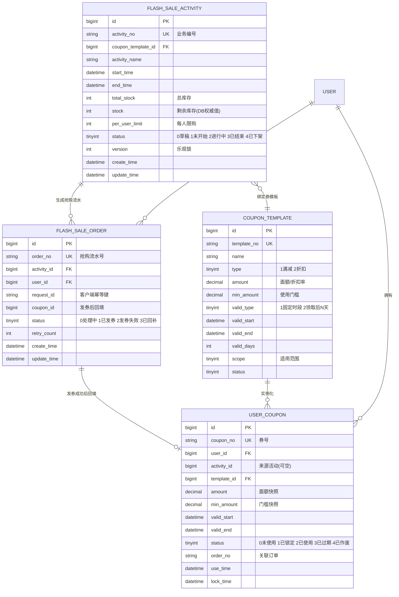
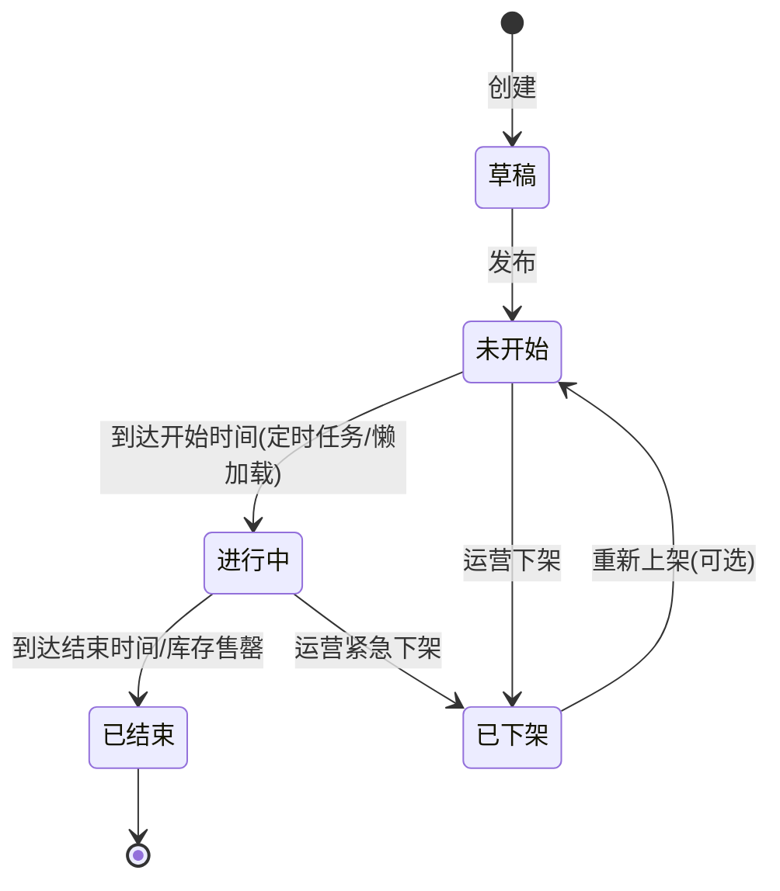
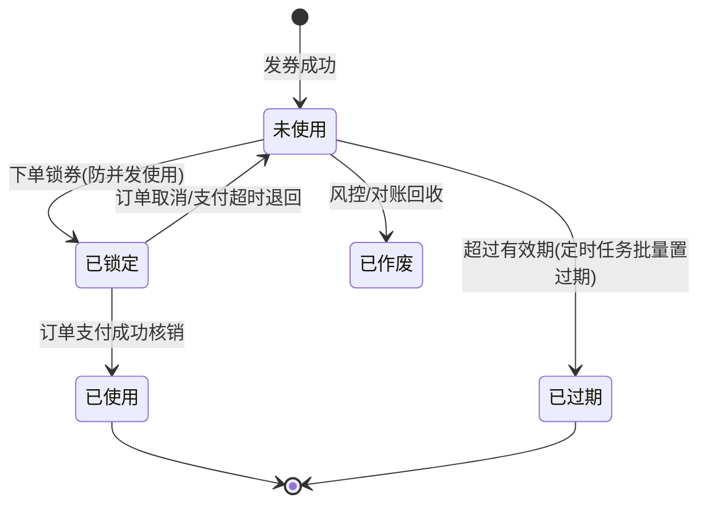
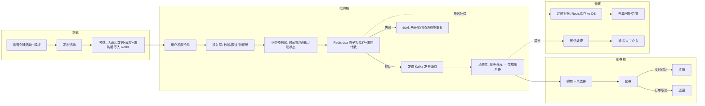
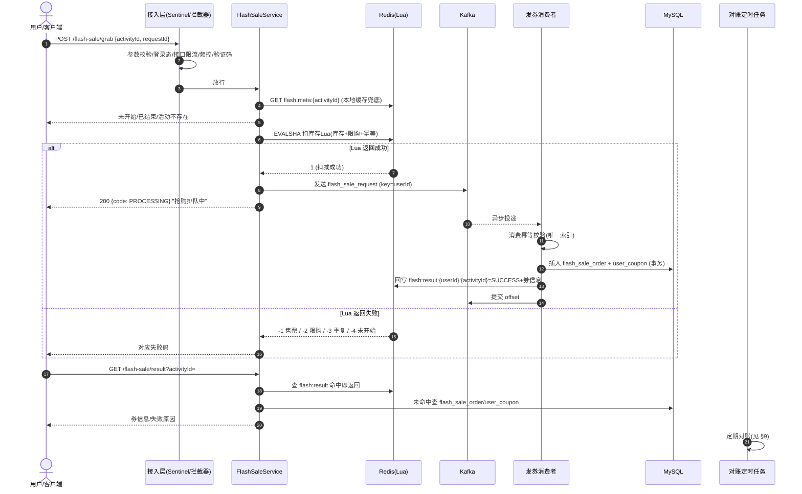
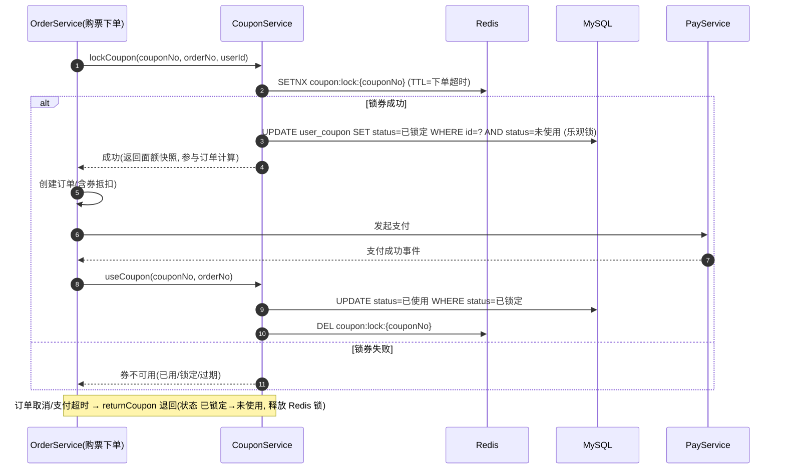
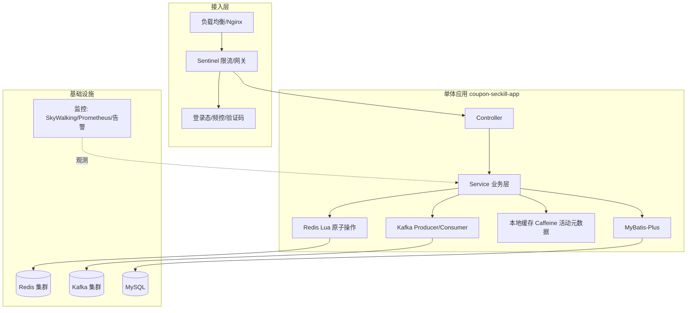
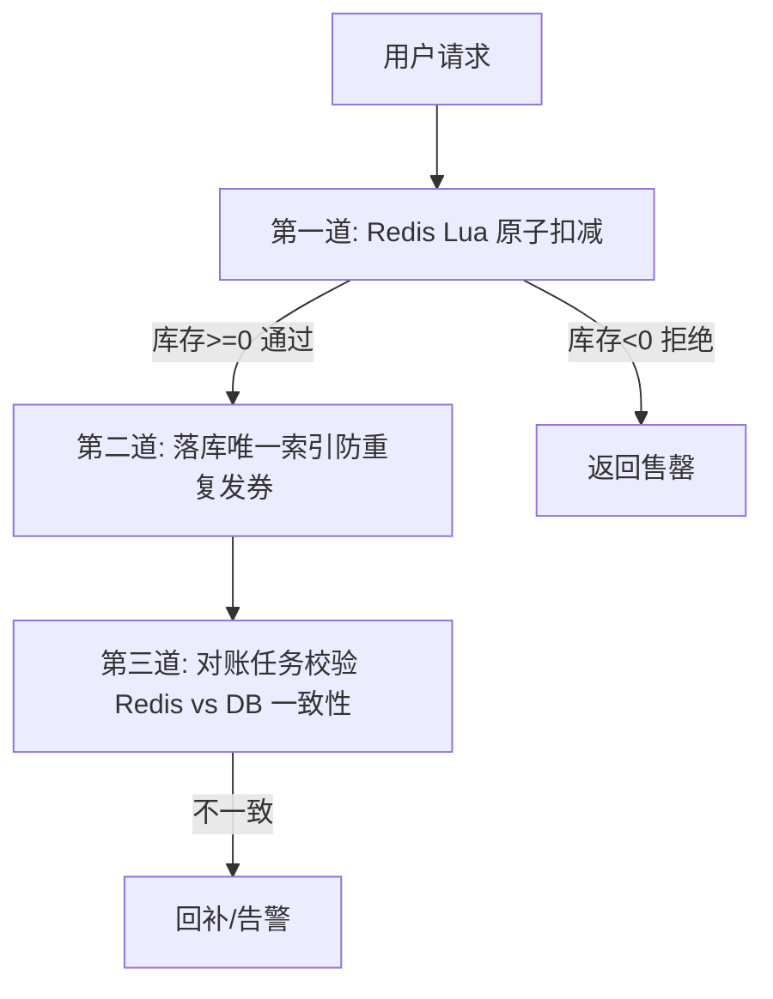
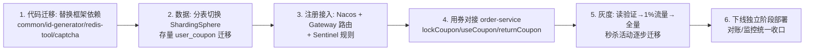

# 优惠券秒杀模块 — 技术设计文档

**Author:** ticketflow 团队
**Date:** 2026-XX-XX
**Status:** Draft
**Version:** 1.0
**Branch:** `feature/coupon-seckill`

---

## 目录

1. [背景、目标与边界](#1-背景目标与边界)
2. [业务模型](#2-业务模型)
3. [核心流程](#3-核心流程)
4. [总体架构与秒杀链路](#4-总体架构与秒杀链路)
5. [数据库设计](#5-数据库设计)
6. [Redis 设计](#6-redis-设计)
7. [Kafka 设计](#7-kafka-设计)
8. [库存与幂等](#8-库存与幂等)
9. [异常与一致性处理](#9-异常与一致性处理)
10. [监控、告警与可观测性](#10-监控告警与可观测性)
11. [独立单体应用结构（实现规划）](#11-独立单体应用结构实现规划)
12. [后续集成到 ticketflow 的方案](#12-后续集成到-ticketflow-的方案)
13. [分支策略与里程碑](#13-分支策略与里程碑)
14. [风险与对策](#14-风险与对策)

---

## 1. 背景、目标与边界

### 1.1 背景

票务平台需要在活动期间运营"优惠券秒杀"：用户在高并发窗口内抢购优惠券，抢到即获得一张券，之后购票下单时使用，实现订单立减。

秒杀场景的典型特征：

| 特征 | 说明 | 对系统的要求 |
|------|------|--------------|
| 瞬时高并发 | 开抢瞬间流量集中，QPS 可能比日常高 2~3 个数量级 | 读多写少、削峰、限流 |
| 稀缺性 | 库存有限，抢购结果二值化（抢到/没抢到） | 严禁超卖 |
| 短时窗口 | 活动持续数分钟到数小时 | 缓存预热、快速收敛 |
| 恶意刷单 | 脚本/机器人在开抢瞬间涌入 | 频控、验证码、幂等 |
| 结果异步 | 抢购成功 ≠ 立即到账（发券有延迟窗口） | 最终一致、可查询 |

### 1.2 目标

1. **独立单体验证**：先在 `feature/coupon-seckill` 分支上以独立单体应用跑通"抢购 → 发券 → 用券 → 核销/退回"完整闭环，验证核心架构与高并发方案（Redis Lua 原子扣减、Kafka 削峰、幂等、对账）。
2. **对齐现有技术栈**：单体应用的技术选型与编码风格刻意对齐 ticketflow 现有约定（Spring Boot 3.3 / MyBatis-Plus / Redis+Lua / Kafka / Sentinel 思路 / 雪花 ID / 统一返回体），为后续无缝集成铺路。
3. **平滑集成**：最终以独立微服务 `ticketflow-coupon-service` 形式接入现有 Spring Cloud Alibaba 体系，与 `order-service` 通过接口契约完成"下单立减"。

### 1.3 边界（本期不做 / 延后）

- 不做支付能力（用券核销挂在订单支付成功事件上，本期用模拟支付/订单状态模拟）。
- 不做优惠券营销中台（发券渠道仅秒杀一种；满减/折扣规则仅做最小可扩展集合）。
- 不直接改现有 ticketflow 微服务代码（独立目录开发，避免污染现有多模块构建）。

---

## 2. 业务模型

### 2.1 核心实体



### 2.2 实体说明与设计要点

| 实体 | 职责 | 设计要点 |
|------|------|----------|
| `coupon_template` 券模板 | 券的"定义"（面额、门槛、有效期、适用范围） | 与活动解耦：未来其他渠道（满赠、签到）也可引用模板；`amount/min_amount` 在发券时**快照**到 `user_coupon`，避免模板改价影响存量券 |
| `flash_sale_activity` 秒杀活动（场次） | 一次抢购窗口（时间、库存、限购、状态） | **库存内嵌在活动表**而非独立库存表：单活动单 SKU，避免多行库存的复杂一致性问题；预留 `version` 乐观锁 |
| `flash_sale_order` 抢购流水 | 抢购请求的唯一记录，发券落库的载体 | 唯一索引防重复；`status` 驱动对账与补偿 |
| `user_coupon` 用户券 | 用户实际持有的券 | `coupon_no` 全局唯一；状态机驱动用券闭环 |

### 2.3 状态机

**活动状态机：**



**用户券状态机：**



### 2.4 业务规则

- **抢购资格**：登录态 + 活动处于"进行中" + 时间窗内 + 每用户未超限购数。
- **一单一券**：抢购成功即发一张券（无支付环节，避免"抢到资格未付款"的库存悬挂问题——**库存回补场景大幅减少**，这是与"秒杀资格+付款"模式的关键差异）。
- **用券规则**：满足门槛（订单金额 ≥ `min_amount`）→ 锁券 → 支付成功核销；订单取消/超时 → 退回。
- **券不可转让**：本期不支持转赠/转让。

---

## 3. 核心流程

### 3.1 流程总览



### 3.2 抢购请求全链路（核心时序）



### 3.3 用券核销流程（与购票对接）



**关键点**：锁券与现有 `order-service` 的 V5 下单链路风格一致——**先 Redis 收敛（锁券标记）再 DB 收敛（乐观锁状态变更）**，Redis 是并发权威，DB 是最终事实。

### 3.4 对账与补偿（兜底闭环）

- 对账口径：`Redis 剩余库存 + DB 已发放数 == 活动总库存`；每用户发放数 ≤ 限购数。
- 发现差异：写告警 + 自动回补（见 §9.4）。

---

## 4. 总体架构与秒杀链路

### 4.1 架构分层



### 4.2 技术选型（刻意对齐 ticketflow 现有约定）

| 组件 | 选型 | 对齐点 |
|------|------|--------|
| 语言/框架 | Java 17 + Spring Boot 3.3 | 与根 pom 一致 |
| ORM | MyBatis-Plus 3.5.7 | 与现有服务一致 |
| 缓存 | Redis + Redisson + Lua 脚本 | 对齐 `ProgramCacheCreateOrderV5Lua` 的单 Lua 原子风格 |
| 消息 | Kafka（幂等 Producer、手动提交） | 对齐 `CreateOrderConsumer`（`SPRING_INJECT_PREFIX_DISTINCTION_NAME-` topic 前缀、高并发消费） |
| 限流 | Sentinel 思路（本地简单实现/后续接框架） | 与 spring-cloud-framework 约定一致 |
| ID | 雪花算法（独立轻量实现，后续换 id-generator-framework） | 对齐现有 |
| 本地缓存 | Caffeine 2.9.3 | 对齐根 pom |
| 配置/注册 | 独立阶段用 application.yml + 本地；集成阶段接 Nacos | — |

### 4.3 秒杀链路的三大设计支柱

1. **Redis 扛峰值**：抢购核心动作（时间窗校验 + 限购计数 + 库存扣减 + 幂等标记）收敛为一个 Lua 脚本原子完成，单次往返 < 1ms，Redis 单实例即可支撑 10 万级 QPS。
2. **Kafka 削峰**：同步接口只做 Redis 操作，**落库与发券完全异步化**；DB 写入压力被消费端并发与批量摊平，数据库不再成为秒杀瓶颈。
3. **DB 兜底 + 对账**：唯一索引防重复、乐观锁防并发修改、定时对账修正极端情况下的不一致（Redis 数据丢失、消息丢失等）。

### 4.4 为什么"同步只做 Redis、异步落库"是正确取舍

| 方案 | 同步写 DB | Redis 扣减 + 异步落库（本方案） |
|------|-----------|--------------------------------|
| 峰值能力 | DB 连接/行锁成为瓶颈，QPS 撑到几千即告警 | 同步路径纯 Redis，QPS 可达 10w+ |
| 一致性 | 强一致 | 最终一致（秒杀抢购结果允许短暂延迟展示） |
| 超卖风险 | 靠 DB 行锁/乐观锁 | Lua 原子扣减，天然不超卖 |
| 复杂度 | 低 | 需消息可靠性 + 对账补偿（已设计） |

**取舍依据**：抢购结果"排队中 → 稍后查询"是可接受的用户体验（业界秒杀通用做法）；换来的容量提升是数量级的。

---

## 5. 数据库设计

### 5.1 表结构 DDL

```sql
-- 券模板
CREATE TABLE `coupon_template` (
  `id`            BIGINT       NOT NULL COMMENT '主键(雪花)',
  `template_no`   VARCHAR(64)  NOT NULL COMMENT '模板业务编号',
  `name`          VARCHAR(128) NOT NULL COMMENT '券名称',
  `type`          TINYINT      NOT NULL COMMENT '类型: 1满减 2折扣',
  `amount`        DECIMAL(10,2) NOT NULL COMMENT '面额(满减)/折扣率(折扣)',
  `min_amount`    DECIMAL(10,2) NOT NULL DEFAULT 0 COMMENT '使用门槛(订单满X可用)',
  `valid_type`    TINYINT      NOT NULL COMMENT '有效期类型: 1固定时段 2领取后N天',
  `valid_start`   DATETIME     NULL COMMENT '固定时段-生效时间',
  `valid_end`     DATETIME     NULL COMMENT '固定时段-失效时间',
  `valid_days`    INT          NULL COMMENT '领取后N天有效',
  `scope`         TINYINT      NOT NULL DEFAULT 0 COMMENT '适用范围(0全场 1指定场次, 扩展)',
  `status`        TINYINT      NOT NULL DEFAULT 1 COMMENT '状态: 1启用 0停用',
  `create_time`   DATETIME     NOT NULL DEFAULT CURRENT_TIMESTAMP,
  `update_time`   DATETIME     NOT NULL DEFAULT CURRENT_TIMESTAMP ON UPDATE CURRENT_TIMESTAMP,
  PRIMARY KEY (`id`),
  UNIQUE KEY `uk_template_no` (`template_no`)
) ENGINE=InnoDB DEFAULT CHARSET=utf8mb4 COMMENT='优惠券模板';

-- 秒杀活动(场次): 库存内嵌
CREATE TABLE `flash_sale_activity` (
  `id`                 BIGINT      NOT NULL COMMENT '主键(雪花)',
  `activity_no`        VARCHAR(64) NOT NULL COMMENT '活动业务编号',
  `coupon_template_id` BIGINT      NOT NULL COMMENT '绑定的券模板ID',
  `activity_name`      VARCHAR(128) NOT NULL COMMENT '活动名称',
  `start_time`         DATETIME    NOT NULL COMMENT '开始时间',
  `end_time`           DATETIME    NOT NULL COMMENT '结束时间',
  `total_stock`        INT         NOT NULL COMMENT '总库存',
  `stock`              INT         NOT NULL COMMENT '剩余库存(DB权威值, 乐观锁更新)',
  `per_user_limit`     INT         NOT NULL DEFAULT 1 COMMENT '每人限购',
  `status`             TINYINT     NOT NULL DEFAULT 0 COMMENT '0草稿 1未开始 2进行中 3已结束 4已下架',
  `version`            INT         NOT NULL DEFAULT 0 COMMENT '乐观锁版本',
  `create_time`        DATETIME    NOT NULL DEFAULT CURRENT_TIMESTAMP,
  `update_time`        DATETIME    NOT NULL DEFAULT CURRENT_TIMESTAMP ON UPDATE CURRENT_TIMESTAMP,
  PRIMARY KEY (`id`),
  UNIQUE KEY `uk_activity_no` (`activity_no`),
  KEY `idx_status_time` (`status`, `start_time`)
) ENGINE=InnoDB DEFAULT CHARSET=utf8mb4 COMMENT='秒杀活动';

-- 抢购流水(发券落库载体): 按 user_id 分表
CREATE TABLE `flash_sale_order_0` (
  `id`          BIGINT      NOT NULL COMMENT '主键(雪花)',
  `order_no`    VARCHAR(64) NOT NULL COMMENT '抢购流水号(业务幂等)',
  `activity_id` BIGINT      NOT NULL,
  `user_id`     BIGINT      NOT NULL,
  `request_id`  VARCHAR(64) NOT NULL COMMENT '客户端幂等键',
  `coupon_id`   BIGINT      NULL COMMENT '发券成功后回填 user_coupon.id',
  `status`      TINYINT     NOT NULL DEFAULT 0 COMMENT '0处理中 1已发券 2发券失败 3已回补',
  `retry_count` INT         NOT NULL DEFAULT 0 COMMENT '消费重试次数',
  `create_time` DATETIME    NOT NULL DEFAULT CURRENT_TIMESTAMP,
  `update_time` DATETIME    NOT NULL DEFAULT CURRENT_TIMESTAMP ON UPDATE CURRENT_TIMESTAMP,
  PRIMARY KEY (`id`),
  UNIQUE KEY `uk_order_no` (`order_no`),
  UNIQUE KEY `uk_activity_user_request` (`activity_id`, `user_id`, `request_id`),
  KEY `idx_user_time` (`user_id`, `create_time`),
  KEY `idx_activity_status` (`activity_id`, `status`)
) ENGINE=InnoDB DEFAULT CHARSET=utf8mb4 COMMENT='抢购流水';

-- 用户券: 按 user_id 分表
CREATE TABLE `user_coupon_0` (
  `id`          BIGINT       NOT NULL COMMENT '主键(雪花)',
  `coupon_no`   VARCHAR(64)  NOT NULL COMMENT '券号(全局唯一)',
  `user_id`     BIGINT       NOT NULL,
  `activity_id` BIGINT       NULL COMMENT '来源秒杀活动(非秒杀发放为空)',
  `template_id` BIGINT       NOT NULL,
  `amount`      DECIMAL(10,2) NOT NULL COMMENT '面额快照',
  `min_amount`  DECIMAL(10,2) NOT NULL DEFAULT 0 COMMENT '门槛快照',
  `valid_start` DATETIME     NOT NULL,
  `valid_end`   DATETIME     NOT NULL,
  `status`      TINYINT      NOT NULL DEFAULT 0 COMMENT '0未使用 1已锁定 2已使用 3已过期 4已作废',
  `order_no`    VARCHAR(64)  NULL COMMENT '关联订单(锁定/核销来源)',
  `lock_time`   DATETIME     NULL,
  `use_time`    DATETIME     NULL,
  `create_time` DATETIME     NOT NULL DEFAULT CURRENT_TIMESTAMP,
  `update_time` DATETIME     NOT NULL DEFAULT CURRENT_TIMESTAMP ON UPDATE CURRENT_TIMESTAMP,
  PRIMARY KEY (`id`),
  UNIQUE KEY `uk_coupon_no` (`coupon_no`),
  KEY `idx_user_status` (`user_id`, `status`),
  KEY `idx_valid_end` (`valid_end`)
) ENGINE=InnoDB DEFAULT CHARSET=utf8mb4 COMMENT='用户优惠券';
```

### 5.2 索引与唯一键设计要点

| 约束 | 位置 | 防的是什么 |
|------|------|-----------|
| `uk_activity_user_request` | flash_sale_order | **重复抢购请求/重复消费**：同一用户对同一活动同一 requestId 只能有一条流水 |
| `uk_order_no` | flash_sale_order | 消息重复投递时的最后一道闸 |
| `uk_coupon_no` | user_coupon | 券号全局唯一（发券幂等兜底） |
| `idx_user_status` | user_coupon | "我的券列表"高频查询 |
| `idx_activity_status` | flash_sale_order | 对账任务按活动扫描 |
| `version` 乐观锁 | flash_sale_activity | 管理端改库存/下架与抢购落库的并发 |

### 5.3 分表策略

- 数据量预估：单场活动百万级抢购流水、千万级用户券 → 按 `user_id` 哈希分 2~4 表（对齐现有 `order_0/order_1` 约定，后续直接切 ShardingSphere）。
- 分表键 `user_id` 保证：同一用户的所有券/流水在同一分片（锁券、列表查询天然单库事务）；跨表查询（按 activity 对账）走"按活动扫描 + 聚合"或对账服务独立只读副本。
- 独立单体阶段先用 MyBatis-Plus 拦截器做**简易分表**（与最终 ShardingSphere 规则一致），集成阶段无缝替换。

### 5.4 字段红线（经验教训沉淀）

- 金额一律 `DECIMAL(10,2)`，禁止 `FLOAT/DOUBLE`。
- 状态字段用 `TINYINT` + 枚举映射，禁止魔法数字散落代码。
- 所有表必须 `create_time/update_time`，方便对账定位。
- 业务编号（`activity_no/order_no/coupon_no`）一律唯一索引——这是幂等的最底层保障。

---

## 6. Redis 设计

### 6.1 Key 规划（统一前缀 `flash:` / `coupon:`）

| Key | 类型 | 生命周期 | 说明 |
|-----|------|----------|------|
| `flash:meta:{activityId}` | Hash | 活动预热 → 结束后 +1 天 | 活动元数据（时间窗/限购/状态/总库存），供 Lua 脚本校验 |
| `flash:stock:{activityId}` | String | 同上 | 剩余库存，Lua `DECR` 原子扣减，**Redis 是并发权威** |
| `flash:limit:{activityId}:{userId}` | String | 预热 → 结束后 +1 天 | 用户已抢计数，限购 |
| `flash:dedup:{activityId}:{userId}:{requestId}` | String | SETNX + TTL 5min | 请求幂等标记（配合 DB 唯一索引双保险） |
| `flash:result:{userId}:{activityId}` | String | 24h | 抢购结果回写（SUCCESS+券号 / 失败原因），支撑结果查询免查库 |
| `coupon:lock:{couponNo}` | String | 下单超时 TTL | 锁券标记（用券并发防护第一道闸） |
| `rate:limit:{userId}:{action}` | String | 滑动窗口 | 防刷频控 |
| `flash:meta:local` | Caffeine | 秒级 TTL | 本地缓存兜底，减少 Redis 热点读 |

### 6.2 核心 Lua 脚本（单脚本原子完成抢购核心动作）

```lua
-- KEYS[1] = flash:stock:{activityId}
-- KEYS[2] = flash:limit:{activityId}:{userId}
-- KEYS[3] = flash:meta:{activityId}
-- ARGV[1] = 当前时间戳  ARGV[2] = 限购数  ARGV[3] = 活动结束时间戳
-- 返回: 1=成功  -1=库存不足  -2=超过限购  -3=活动未开始/已结束

local meta = redis.call('HGETALL', KEYS[3])
if #meta == 0 then return -3 end
local startTs = tonumber(meta[2])   -- 按实际 Hash 字段顺序取
local endTs   = tonumber(meta[4])
if ARGV[1] < startTs or ARGV[1] > endTs then return -3 end

local limit = tonumber(ARGV[2])
local bought = tonumber(redis.call('GET', KEYS[2]) or '0')
if bought >= limit then return -2 end

local stock = tonumber(redis.call('DECR', KEYS[1]))
if stock < 0 then
    redis.call('INCR', KEYS[1])  -- 回加，避免负库存
    return -1
end

redis.call('INCR', KEYS[2])
redis.call('EXPIRE', KEYS[2], ARGV[3] - ARGV[1] + 86400)
return 1
```

**设计要点**：

- **限购与库存同一脚本原子完成**——对齐现有 `ProgramCacheCreateOrderV5Lua` 的"多动作单 Lua"风格（现有项目 V5 正是把限购检查并入 Lua 原子执行，见 `86825d4`）。
- 库存为负立即回加：即使出现并发异常也**永不出现负库存**。
- 时间窗校验放脚本内：避免"应用层校验通过、到达 Redis 时已开抢/已结束"的竞态。
- 活动元数据 Hash 字段顺序固定（代码注释标明），脚本内按下标读取；更稳妥做法是存 JSON 字符串一次 GET（取舍：JSON 更易扩展，Hash 省反序列化，本设计选 JSON 单字段，见下）。

> 修正建议（落地时采用）：`flash:meta:{activityId}` 用单个 String 存 JSON（`{"start":..,"end":..,"limit":..,"total":..,"status":..}`），Lua 里 `cjson.decode` 后取字段，**避免 Hash 字段顺序耦合**。Redis 6.0+ 自带 cjson。

### 6.3 缓存预热与收敛

| 时机 | 动作 |
|------|------|
| 活动发布 | 写入 `flash:meta`；初始化 `flash:stock = total_stock`；写 0 限购键（惰性） |
| 开抢前 10min | 预热任务确认键存在、TTL 正确 |
| 抢购结束/售罄 | 活动状态置"已结束"，结果查询全部命中失败码；库存键保留至 TTL 自然过期 |
| 紧急下架 | 删除 `flash:meta` 并使脚本返回 -3（活动不可抢），DB 状态同步 |

### 6.4 防刷与限流

1. **接口限流**：Sentinel 思路，按 `userId + activityId` 组合限频（如 3 次/秒），超限返回"操作过于频繁"。
2. **验证码**：开抢瞬间可开启滑块/图形验证码（对齐 `ticketflow-captcha-manage-framework` 能力，独立阶段先做简单图形码，集成阶段复用框架）。
3. **幂等**：`requestId` 由客户端生成（UUID），服务端 SETNX 去重 + DB 唯一索引兜底。
4. **设备/账号风控（预留）**：黑名单、同设备多账号检测（本期只留扩展点）。

---

## 7. Kafka 设计

### 7.1 Topic 规划

| Topic | 分区 | 说明 |
|-------|------|------|
| `{prefix}-flash_sale_request` | 12~48（= 消费并发） | 抢购成功后的**发券请求**，key=userId |
| `{prefix}-flash_sale_dlt` | 3 | 死信队列：重试耗尽的消息 |
| （预留）`{prefix}-flash_sale_result` | 12 | 结果回写事件（本期直接写 Redis + DB，暂不引入） |

- 命名沿用现有 `SPRING_INJECT_PREFIX_DISTINCTION_NAME-` 前缀约定（对齐 `CreateOrderConsumer`）。
- **key=userId**：同一用户的抢购/发券请求进入同一分区，保证同一用户串行处理（简化限购与发券的本地一致性）。

### 7.2 生产者可靠性

- `enable.idempotence=true`（幂等 Producer，防重复写入）。
- `acks=all` + `min.insync.replicas>=2`（Leader 确认 + ISR 多数派）。
- **发送失败补偿**：抢购接口在 Lua 扣减成功后发送 Kafka；若发送抛异常（broker 不可用），**立即反向回补 Redis 库存与限购计数**（Lua 反向脚本），并返回"系统繁忙，请重试"——保证"扣了库存但没发出消息"的窗口尽可能短。

### 7.3 消费者设计（对齐 CreateOrderConsumer 风格）

- `enable.auto.commit=false`，**业务落库成功后再手动提交 offset**。
- 消费并发 = 分区数（对齐现有 48 并发）。
- 处理步骤：
  1. 幂等校验：按 `uk_activity_user_request` 插入 `flash_sale_order`（唯一索引冲突 → 已处理，直接提交）。
  2. 同事务生成 `user_coupon`（券号雪花生成，`uk_coupon_no` 兜底）。
  3. 回写 `flash:result:{userId}:{activityId}`。
  4. 更新 `flash_sale_order.status=已发券`。
  5. 手动提交 offset。
- **消费失败重试**：业务异常（非幂等冲突）按 `retry_count` 重试（本地延迟重试 / 重新投递），超过阈值（如 5 次）投递 `flash_sale_dlt` 并告警。
- **不依赖消息顺序**：幂等由唯一索引保证，允许乱序消费（对账任务兜底）。

### 7.4 消息语义总结

| 风险 | 防御 |
|------|------|
| 消息丢失（producer 侧） | 幂等 Producer + acks=all；发送失败反向回补 Redis |
| 消息丢失（consumer 侧） | 手动提交 + 落库后提交；重启从上次 offset 续读 |
| 消息重复 | 消费幂等（唯一索引）+ 手动提交只提交已处理 offset |
| 消费失败 | 重试 N 次 → 死信 → 告警 → 对账补偿 |
| broker 故障 | 多副本 + ISR；短时降级为"抢购排队中"由对账兜底 |

---

## 8. 库存与幂等

### 8.1 超卖控制（三层防线）



1. **Redis Lua 原子扣减**（并发权威）：`DECR` 天然原子，负库存回加，**并发下不可能超卖**。
2. **DB 唯一索引**（落库闸门）：即使极端情况（Redis 故障恢复后数据错乱）导致多放行，`uk_activity_user_request` + 发券数量对账也会暴露。
3. **对账任务**（最终收敛）：见 §9.4。

### 8.2 幂等设计（三层）

| 层级 | 幂等键 | 机制 |
|------|--------|------|
| 请求层 | `(userId, activityId, requestId)` | Redis `SETNX flash:dedup:...` TTL 5min → 重复请求直接返回第一次的结果语义 |
| 落库层 | `(activity_id, user_id, request_id)` 唯一索引 | 重复消息插入冲突 → 视为已处理 |
| 发券层 | `order_no` / `coupon_no` 唯一索引 | 消息级重复的最后闸门 |

### 8.3 分布式锁的使用边界（克制原则）

- **抢购扣库存：不用分布式锁**——Lua 原子脚本已足够，Redisson 锁反而成为瓶颈（对齐现有 V5 项目"能 Lua 就不加锁"的优化取向）。
- **锁券：Redis SETNX + DB 乐观锁双层**——锁券是"券级"互斥，SETNX 原子且带 TTL 防死锁；DB `UPDATE ... WHERE status=未使用` 兜底。
- **管理端操作（改库存/下架）**：DB 乐观锁 `version` 即可，不引入分布式锁。
- 结论：**本模块不依赖 Redisson 分布式锁**（除非未来出现跨实例的复合操作，如"多券组合下单"，届时按需引入并控制粒度）。

### 8.4 库存回补场景与时机

| 场景 | 触发 | 处理 |
|------|------|------|
| 扣库存成功但 Kafka 发送失败 | 抢购接口同步补偿 | Lua 反向脚本回补库存+限购计数 |
| 消息消费最终失败（死信） | DLT 消费/定时任务 | 回补库存 + 更新流水状态=已回补 + 告警 |
| 对账发现 Redis 与 DB 不一致 | 对账任务 | 以 DB 为权威修正 Redis（重载库存键） |
| 风控判定恶意抢购（预留） | 风控回调 | 作废券 + 回补库存 |

---

## 9. 异常与一致性处理

### 9.1 异常分类与响应码设计

| 分类 | 场景 | 对外码 | 处理策略 |
|------|------|--------|----------|
| 参数错误 | activityId 非法、requestId 缺失 | 40001 | 直接拒绝 |
| 未登录 | token 失效 | 40100 | 引导登录 |
| 业务失败 | 未开始/已结束/售罄/限购/重复 | 50010~50014 | 直接返回，**不重试**（对齐现有 50009 风格） |
| 系统繁忙 | Redis 不可用、Kafka 发送失败 | 50020 | 提示稍后重试（客户端可重试，服务端幂等兜底） |
| 内部错误 | 未预期异常 | 50000 | 告警 + 兜底对账 |

### 9.2 一致性目标与取舍

- **抢购环节**：Redis 预扣是权威，允许"抢购成功但发券延迟"（最终一致），**不允许**"没抢到却发了券"或"超卖"。
- **用券环节**：锁券/核销/退回必须是**强一致**（涉及订单金额，不能最终一致）——全部走 DB 事务 + 乐观锁，Redis 只做第一道并发闸门。
- **对齐现有项目经验**：现有 V5 链路已确立"Redis 收敛先行、Feign/DB 收敛后行、Lua 失败不残留 DB 变更"的原则（见 `e2cfaa7`），本模块沿用。

### 9.3 各环节一致性矩阵

| 环节 | 手段 | 失败处理 |
|------|------|----------|
| 扣库存 | Lua 原子 DECR | 返回失败码，无副作用 |
| 发消息 | 幂等 Producer | 同步回补 Redis |
| 消费落库 | 事务 + 唯一索引 | 重试 → 死信 → 回补 |
| 发券 | 同事务生成 user_coupon | 同上 |
| 锁券 | SETNX + 乐观锁 UPDATE | 返回券不可用 |
| 核销 | 乐观锁 UPDATE status=已使用 | 抛错回滚订单侧 |
| 退回 | 乐观锁 UPDATE status=未使用 | 重试/人工 |

### 9.4 对账任务设计（最终一致性的收敛器）

| 任务 | 频率 | 逻辑 | 处置 |
|------|------|------|------|
| 库存对账 | 活动进行中每 5min / 结束后 1 次 | 对每个活动：`Redis stock + DB 已发券数 == total_stock` | 不一致 → 以 DB 为准重载 Redis 库存键 + 告警 |
| 限购对账 | 同上 | 每用户 `DB 发放数 <= per_user_limit` | 超限 → 作废多余券 + 回补 + 告警 |
| 发券超时扫描 | 每 1min | `flash_sale_order.status=处理中 且 create_time > 5min` | 重新投递 / 标记失败回补 |
| 死信消费 | 持续 | 读 DLT 归类 | 可重试的重新投递；不可重试的回补库存 |
| 券过期 | 每 10min | `status=未使用 且 valid_end < now` | 批量置已过期 |

### 9.5 系统异常兜底

- **Redis 故障**：抢购接口直接返回"系统繁忙"（限流降级），绝不落库放行（避免无库存兜底地发券）；DB 侧唯一索引保持最终正确。
- **Kafka 长时间不可用**：降级策略——抢购接口暂停扣减（返回繁忙），活动可整体推迟/下线；恢复后对账任务收敛。
- **DB 故障**：抢购仍可扣 Redis 库存，但消费端落库失败会重试/死信；若超过容忍窗口，自动暂停扣减（熔断开关），防止 Redis 库存扣空而 DB 无记录。

---

## 10. 监控、告警与可观测性

### 10.1 核心指标（Prometheus + Micrometer）

| 指标 | 说明 | 告警阈值 |
|------|------|----------|
| `flash_grab_qps` | 抢购接口 QPS | 容量拐点（压测标定） |
| `flash_grab_success_rate` | 抢购成功率（含业务拒绝码分布） | 异常突降告警 |
| `flash_stock_remaining{activity}` | 库存水位 | 售罄事件、回补事件 |
| `flash_sale_result_latency` | 抢购→发券成功延迟 | p99 > 30s |
| `kafka_lag{flash_sale_request}` | 消息积压 | > 10000 持续 5min |
| `flash_issue_fail_count` | 发券失败数 | > 0 即告警 |
| `flash_reconcile_diff` | 对账差异数 | > 0 即告警（严重） |
| `coupon_lock_fail_rate` | 锁券失败率 | 异常突增 |

### 10.2 链路追踪与日志

- 集成阶段接 SkyWalking（现有项目已引入 `skywalking.apm-toolkit`）；独立阶段先规范日志 traceId（MDC：`requestId + userId + activityId` 贯穿 抢购→Kafka→落库）。
- 关键日志点：Lua 返回码、Kafka 发送结果、消费落库结果、对账差异明细（活动、userId、差异值）。
- 对账/死信全部输出结构化 JSON 日志，便于检索。

### 10.3 运营可视化（管理端）

- 活动实时面板：剩余库存、已抢人数、限购命中、失败分布。
- 用户券台账：按用户/活动/状态检索。

---

## 11. 独立单体应用结构（实现规划）

> 独立单体的价值：**在不动现有代码的前提下，把秒杀主链路、并发模型、一致性方案全部验证一遍**；同时代码结构与现有框架刻意同构，集成时是"搬运 + 替换依赖"而非"重写"。

### 11.1 目录结构

```
coupon-seckill/
├── pom.xml                      # 独立 Maven 工程(不继承根 pom, 避免污染现有多模块构建)
├── docs/                        # 本设计文档及后续补充
├── sql/                         # 建表脚本(与 §5 对应)
└── src/main/
    ├── java/com/couponseckill/
    │   ├── CouponSeckillApplication.java
    │   ├── common/              # Result/错误码/BizException/全局异常处理
    │   ├── config/              # Redis/Kafka/MyBatis-Plus/Caffeine 配置
    │   ├── controller/          # FlashSaleController / UserCouponController / ManageController
    │   ├── service/             # FlashSaleGrabService / CouponIssueService / CouponUseService
    │   ├── service/lua/         # FlashSaleGrabLua / StockRollbackLua / CouponLockLua (对齐现有 lua 包)
    │   ├── kafka/               # FlashSaleRequestProducer / FlashSaleRequestConsumer / DltConsumer
    │   ├── mapper/ entity/      # 与 §5 表对应
    │   ├── task/                # ReconcileTask / IssueTimeoutTask / CouponExpireTask
    │   └── id/                  # 轻量雪花ID(集成时替换为 id-generator-framework)
    └── resources/
        ├── application.yml
        └── lua/                 # .lua 脚本文件(对齐现有项目"脚本外置+预加载"风格)
```

### 11.2 与现有框架的对应关系（集成时替换清单）

| 独立阶段自建 | 集成阶段替换为 | 理由 |
|-------------|----------------|------|
| `common/Result/错误码` | `ticketflow-common` | 统一返回体与错误码规范 |
| `id/` 轻量雪花 | `ticketflow-id-generator-framework` | 全局 ID 服务 |
| 手写 Lua 封装 | `ticketflow-redis-tool-framework` + `redisson-framework` | 脚本管理/序列化统一 |
| 手写 Kafka 配置 | `spring-cloud-framework` 消息约定 | topic 前缀、序列化统一 |
| 简易分表拦截器 | ShardingSphere（与现有 order 分表一致） | 分片规则统一 |
| 自建限流 | Sentinel（spring-cloud-alibaba） | 全局限流/降级策略统一 |
| 自建验证码 | `ticketflow-captcha-manage-framework` | 复用验证码能力 |

**独立阶段刻意保留的自建实现要遵循与框架相同的接口形态**（如 Lua 脚本外置、Redis 操作封装风格、Result 结构），保证替换成本是"换实现类"而非"改业务代码"。

---

## 12. 后续集成到 ticketflow 的方案

### 12.1 集成方式对比

| 方案 | 形态 | 优点 | 缺点 | 结论 |
|------|------|------|------|------|
| **A. 独立微服务** | 新增 `ticketflow-coupon-service`，注册 Nacos，走 Gateway | 与现有架构一致；秒杀流量与交易流量物理隔离；独立扩缩容 | 多一个服务运维成本 | ✅ **推荐** |
| B. 并入现有服务 | 塞进 user-service 或 base-data-service | 省运维 | 秒杀瞬时流量冲击订单/用户服务；耦合坏味道 | ❌ |
| C. 独立进程 + 旁路 | 单独部署但不在 Nacos 体系 | 隔离彻底 | 与现有体系割裂，管理/观测成本高 | 过渡可选 |

**结论**：按方案 A 落地，与现有 `ticketflow-user-service / order-service / pay-service` 平级。

### 12.2 集成步骤（分阶段，可灰度）



### 12.3 与 order-service 的接口契约（预留，集成时实现）

```text
# 下单立减对接（order-service → coupon-service，Feign/RPC）
POST /coupon/lock     {couponNo, userId, orderNo}   → 成功返回面额快照（参与订单金额计算）
POST /coupon/use      {couponNo, userId, orderNo}   → 支付成功回调核销
POST /coupon/return   {couponNo, userId, orderNo}   → 订单取消/超时退券

# 对外用户接口（gateway → coupon-service）
POST /flash-sale/grab   {activityId, requestId}     → 抢购
GET  /flash-sale/result?activityId=                 → 抢购结果
GET  /user/coupons?status=                          → 我的券列表

# 管理端（ticketflow-front-manage 对接）
POST /manage/activity (创建/发布/下架/改库存)
GET  /manage/activity/stats
```

**对接要点**：
- `lockCoupon` 参与下单事务边界的方式对齐现有 V5 下单链路：锁券（Redis SETNX）在创建订单前完成，核销在支付成功事件中触发；`returnCoupon` 由订单取消/支付超时链路触发。
- 订单金额计算：下单时用券 → 订单行记录券抵扣金额快照，核销时校验快照一致（防改价）。
- 若未来订单支持"多券/拆单"，扩展为 `lockCoupons` 批量接口（届时再评估分布式锁粒度）。

### 12.4 数据迁移与灰度注意

- `user_coupon` 存量数据：按 `user_id` 哈希迁移到新分片；迁移期间用券接口双写校验（新表写、旧表读）直到对账一致。
- 秒杀活动灰度：新活动走 coupon-service，旧活动走老路径；验证稳定后全量切换。
- 对账任务在集成后仍保留（跨服务一致性收敛器）。

---

## 13. 分支策略与里程碑

### 13.1 分支

```text
master ──────────────────────────────── (现有主分支, 不动)
v5-optimization ── ... (现有优化分支, 不动)
feature/coupon-seckill ← 本次新建, 承载独立单体开发
    └── 后续按功能拆子分支: feat/seckill-grab / feat/coupon-use / feat/reconcile ...
集成时: feature/coupon-seckill → 合并出新分支 feature/coupon-service-integration 再入 master
```

### 13.2 里程碑

| 里程碑 | 内容 | 验收标准 |
|--------|------|----------|
| M0 | 分支与设计文档（本次） | 设计评审通过 |
| M1 | 单体骨架 + 建表 + 活动管理端 | 活动可创建/发布/预热，Redis 键正确初始化 |
| M2 | 抢购主链路：Lua 扣减 + Kafka 发券 + 结果查询 | 单机压测 ≥ 2w QPS 不超卖、幂等通过（对齐现有 benchmark 目录的压测口径：端到端落库率为主指标） |
| M3 | 用券闭环：锁券/核销/退回 + 对账任务 | 下单立减全流程可用；对账可发现并修复注入的不一致 |
| M4 | 压测与优化：库存水位、积压、失败分布 | 容量拐点标定；与现有 V5 项目方法论对齐 |
| M5 | 集成：独立服务 + order-service 对接 + 灰度 | 现有环境跑通"抢券→购票立减"端到端 |

---

## 14. 风险与对策

| # | 风险 | 等级 | 对策 |
|---|------|------|------|
| 1 | Redis 扣减成功但消息/落库丢失，库存悬空 | 高 | 同步回补 + 发券超时扫描 + 对账任务（§8.4/§9.4） |
| 2 | 超卖（并发极端场景） | 高 | Lua 原子扣减 + 唯一索引 + 对账三层防线（§8.1） |
| 3 | 恶意刷单/脚本抢购 | 中 | 频控 + 验证码 + 幂等 + 风控扩展点（§6.4） |
| 4 | 活动时间窗竞态（应用层校验与 Redis 不一致） | 中 | 时间窗校验下沉到 Lua 脚本内（§6.2） |
| 5 | Kafka 积压导致发券延迟超预期 | 中 | 分区数=消费并发；监控 lag 告警；必要时批量消费（对齐现有 48 并发） |
| 6 | 库存键 TTL 管理失误（活动未结束库存键过期） | 中 | 预热任务校验 TTL；对账任务重建键；Lua 内 meta 不存在视为不可抢 |
| 7 | 用券并发（同一券被两个订单锁定） | 高 | Redis SETNX + DB 乐观锁双层（§8.3） |
| 8 | 集成期订单金额计算与券快照不一致 | 中 | 下单时快照券面额入订单行；核销校验快照 |
| 9 | 独立单体与现有框架"同构度"不足，集成返工 | 中 | 独立阶段强制按 §11.2 清单对齐接口形态 |
| 10 | 分表后按活动对账跨分片 | 低 | 对账走独立只读副本/离线聚合（§5.3） |

---

## 附录 A：与现有 ticketflow 项目的对齐记录（现状调研结论）

| 现状 | 出处 | 对本设计的影响 |
|------|------|----------------|
| 微服务架构：gateway/user/order/program/pay/admin/base-data 等 | `ticketflow-server/` | 集成走独立服务方案 |
| Spring Boot 3.3 / Java 17 / MyBatis-Plus 3.5.7 / Spring Cloud Alibaba 2023 | 根 `pom.xml` | 单体技术选型对齐 |
| Kafka topic 前缀 `SPRING_INJECT_PREFIX_DISTINCTION_NAME-`，`create_order` 消费并发 48 | `CreateOrderConsumer.java` | 本模块 topic/并发对齐 |
| V5 下单链路：Lua 原子收敛 Redis 权威、Feign/DB 后收敛、Lua 失败不残留 DB 变更 | git log `e2cfaa7` `86825d4` `dbf2c1c` | 抢购/锁券链路沿用该原则 |
| 分库分表：order_0/order_1 等 | `sql/cloud/` | user_coupon/flash_sale_order 分表对齐 |
| 压测方法论：端到端落库率主指标、多轮中位数、lag 清零闭环 | `benchmark/` | M2/M4 压测口径复用 |
| 监控：SkyWalking toolkit 9.4 | 根 pom | 链路追踪对齐 |
| 当前无任何优惠券/秒杀代码 | 全仓检索 | 全新模块，无兼容负担 |

---

*本文档为设计基线，落地时以代码与压测数据为准持续修订（修订记录：V1.0 初稿）。*
